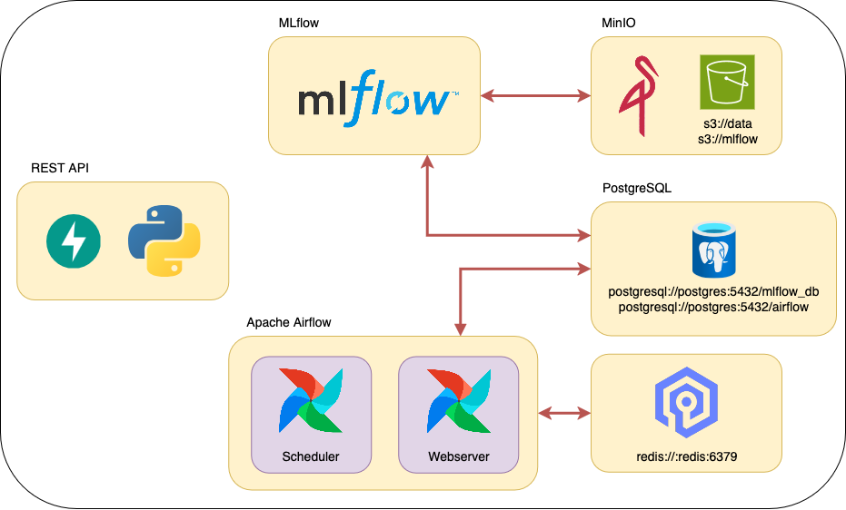

# 🚀 Ambiente Productivo MLOps

### MLOps1 - CEIA - FIUBA

**Integrantes:**
* Luis Ali (a2401)
* Santiago Bartolini Rizzo (a2402)

### Descripción

Pipeline completo de MLOps para entrenar y servir modelos de Machine Learning con datos de colisiones de electrones del CERN.

---

## 📚 Documentación

| Documento | Descripción |
|-----------|-------------|
| **[dockerfiles/fastapi/README.md](dockerfiles/fastapi/README.md)** | 📖 Documentación técnica de la API |

---

## 🎯 Quick Start

```bash
# 1. Levantar todos los servicios
docker compose --profile all up -d

# 2. Acceder a Airflow
# http://localhost:8080
# Usuario: airflow
# Password: airflow

# 3. Ejecutar el pipeline de procesamiento
# En Airflow UI → DAGs → process_cern_data → Trigger DAG
# Esto procesa los datos y automáticamente dispara el entrenamiento

# 4. Ver experimentos en MLflow
# http://localhost:5001

# 5. Probar la API (después de que el modelo esté entrenado)
curl http://localhost:8800/health
curl http://localhost:8800/docs
```

**Nota**: Si tienes problemas de espacio en disco, ejecuta el script de limpieza antes de iniciar:
- **Windows**: `.\cleanup_before_start.ps1`
- **macOS/Linux**: `./cleanup_before_start.sh`

### Servicios Disponibles

- **Airflow**: http://localhost:8080 (user: `airflow`, pass: `airflow`)
- **MLflow**: http://localhost:5001
- **MinIO**: http://localhost:9001 (user: `minio`, pass: `minio123`)
- **API**: http://localhost:8800
- **API Docs**: http://localhost:8800/docs

#### Servicios
- [Apache Airflow](https://airflow.apache.org/)
- [MLflow](https://mlflow.org/)
- API Rest para servir modelos ([FastAPI](https://fastapi.tiangolo.com/))
- [MinIO](https://min.io/)
- Base de datos relacional [PostgreSQL](https://www.postgresql.org/)
- Base de dato key-value [ValKey](https://valkey.io/) 



Por defecto, cuando se inician los multi-contenedores, se crean los siguientes buckets:

- `s3://data`
- `s3://mlflow` (usada por MLflow para guardar los artefactos).

y las siguientes bases de datos:

- `mlflow_db` (usada por MLflow).
- `airflow` (usada por Airflow).

## Instalación

1. Para poder levantar todos los servicios, primero instala [Docker](https://docs.docker.com/engine/install/) en tu computadora (o en el servidor que desees usar).
2. Clona este repositorio.
3. Crea las carpetas `airflow/config`, `airflow/dags`, `airflow/logs`, `airflow/plugins`.
4. Si estás en Linux o MacOS, en el archivo `.env`, reemplaza `AIRFLOW_UID` por el de tu usuario o alguno que consideres oportuno (para encontrar el UID, usa el comando `id -u <username>`). De lo contrario, Airflow dejará sus carpetas internas como root y no podrás subir DAGs (en `airflow/dags`) o plugins, etc.
5. En la carpeta raíz de este repositorio, ejecuta:

```bash
docker compose --profile all up
```

6. Una vez que todos los servicios estén funcionando (verifica con el comando `docker ps -a` que todos los servicios estén healthy o revisa en Docker Desktop), podrás acceder a los diferentes servicios mediante:
   - Apache Airflow: http://localhost:8080
   - MLflow: http://localhost:5001
   - MinIO: http://localhost:9001 (ventana de administración de Buckets)
   - API: http://localhost:8800/
   - Documentación de la API: http://localhost:8800/docs

Si estás usando un servidor externo a tu computadora de trabajo, reemplaza `localhost` por su IP (puede ser una privada si tu servidor está en tu LAN o una IP pública si no; revisa firewalls u otras reglas que eviten las conexiones).

Todos los puertos u otras configuraciones se pueden modificar en el archivo `.env`.

## Desplegar el Modelo

### Quick Start

```bash
# 1. Entrenar modelo usando DAG de Airflow
# Los DAGs están en: airflow/dags/

# 2. Configurar modelo en .env
MODEL_NAME=cern_xgboost
MODEL_STAGE=Production

# 3. Iniciar servicios
docker compose --profile all up

# 4. Probar API
curl http://localhost:8800/health
curl -X POST http://localhost:8800/predict \
  -H "Content-Type: application/json" \
  -d '{"data": [{"pt1": 25.5, "pt2": 30.2, ...}]}'
```

### Arquitectura del Código

El proyecto sigue **principios SOLID** y **PEP 8**:

```
dockerfiles/fastapi/
├── main.py             # Aplicación FastAPI principal
├── config.py           # Configuración (SRP)
├── schemas.py          # Schemas Pydantic (ISP)
├── exceptions.py       # Excepciones personalizadas (OCP)
├── model_loader.py     # Cargador de modelos (DIP)
├── predictor.py        # Lógica de predicción (SRP)
└── test_api.py         # Tests de la API
```

**Características**:
- ✅ Arquitectura limpia y modular
- ✅ Type hints completos
- ✅ Documentación exhaustiva
- ✅ Manejo robusto de errores
- ✅ Logging estructurado
- ✅ Inyección de dependencias
- ✅ Validación de datos con Pydantic
- ✅ Tests automatizados

## Apagar los servicios

Estos servicios ocupan cierta cantidad de memoria RAM y procesamiento, por lo que cuando no se están utilizando, se recomienda detenerlos. Para hacerlo, ejecuta el siguiente comando:

```bash
docker compose --profile all down
```

Si deseas no solo detenerlos, sino también eliminar toda la infraestructura (liberando espacio en disco), utiliza el siguiente comando:

```bash
docker compose down --rmi all --volumes
```

Nota: Si haces esto, perderás todo en los buckets y bases de datos.

## 📚 Más Información

- **[FastAPI README](dockerfiles/fastapi/README.md)**: Documentación técnica de la API
- **[DAGs de Airflow](airflow/dags/)**: Pipelines de procesamiento y entrenamiento

## 🧪 Testing

Para probar la API después del despliegue:

```bash
# Instalar requests si no lo tienes
pip install requests

# Ejecutar tests
python dockerfiles/fastapi/test_api.py
```

## 🎯 Endpoints de la API

Una vez desplegado, la API expone los siguientes endpoints:

- `GET /` - Mensaje de bienvenida
- `GET /health` - Estado del servicio y modelo
- `GET /model/info` - Información del modelo cargado
- `POST /model/reload` - Recargar modelo desde MLflow
- `POST /predict` - Hacer predicciones
- `GET /docs` - Documentación interactiva (Swagger UI)
- `GET /redoc` - Documentación alternativa (ReDoc)
